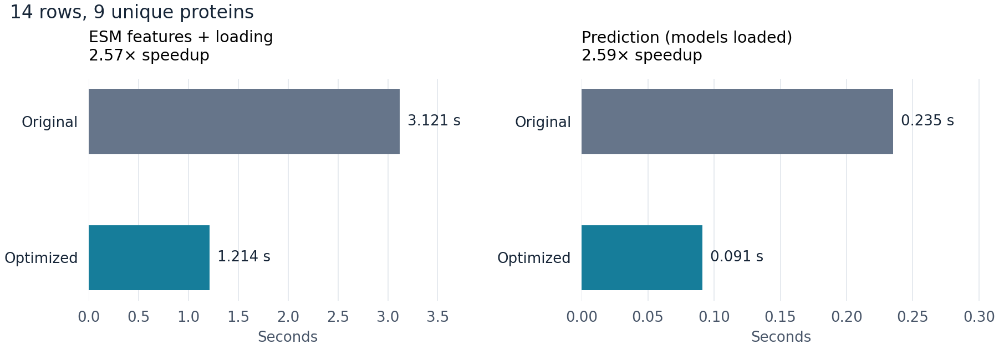

# Saved Colab example

14 public examples, measured on one G4 on 9 October 2026. Each time is the median of three runs.

| Stage | Original (s) | Optimized (s) | Speedup |
| --- | ---: | ---: | ---: |
| ESM features + loading | 3.1214 | 1.2137 | 2.57× |
| Prediction (models loaded) | 0.2351 | 0.0909 | 2.59× |

ESM timing includes loading its model and generating features for nine unique proteins. Prediction timing uses loaded models and features, with all ten FP32 kcat models and batch size 50. Kcat model loading was measured separately at 0.407 seconds.

The raw ESM features, member outputs, predictions and uncertainties matched exactly. All 75 tests passed.

An RDKit update interrupted the prediction stage. Its version was restored from 2026.9.1 to 2026.3.6, and prediction testing resumed on the same G4. The completed ESM measurements were retained; both versions within each stage used the same environment. The notebook now pins the validated dependencies.

- [Open the notebook](../../../colab_compare.ipynb)
- [Download results and raw arrays](results.zip)
- [Download the plot as SVG](stage_comparison.svg)
- [Independent verification](verification.json)
- [Dependency repair](dependency_repair.json) and [original execution](initial/execution.json)
